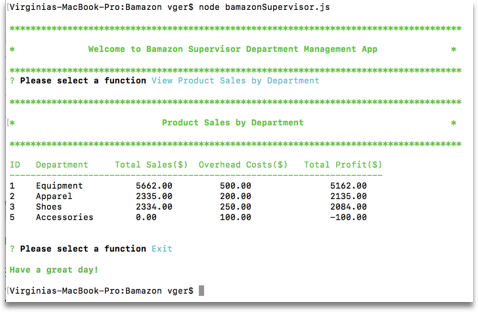

# Bamazon
Node.js &amp; MySQL application

## Description: ##

A multi-app collection that helps with customer point of sale, inventory and store management functions.

## Implementation ##

Using node.js and various libraries, created applications to help with managing a retail store.
* **bamazonCustomer.js:** Used to process a customer's purchase.
  * This application displays the items for sale and allows the customer to select a product and quanity. Once the purchase is complete, the customer is notified of their purchase and the amount due. The app will also add the current puchase to the total_sales amount. The app will not display the total sales column to the customer.
  * Link to video: [Bamazon Customer](https://drive.google.com/file/d/19qeyLUsjshLld2a5UsC-mfhUwlQgEsah/view?usp=sharing)
* **bamazonManager.js:** Used to manage the store's inventory.
  * *View Products for Sale:* Lists every available item: the item IDs, names, prices, quantities and product sales.
  * *View Low Inventory:* Lists all items with an inventory count lower than five.
  * *Add to Inventory:* Displays a prompt that will let the manager "add more" of any item currently in the store.
  * *Add New Product:* Adds a new product to the store.
  * *Link to video:* [Bamazon Manager](https://drive.google.com/open?id=14UfWqV9X78qLLmTD1x0LDsIYp8gANyeF)
* **bamazonSupervisor.js:** Used to evaluate the store's profits and structure.
  * *View Product Sales by Department:* Lists the total sales by department. If a department exists where no products have been sold, the profit value shown will be the overhead costs (negative value).
  * *Create New Department:* Adds a new department to the store.
  * Link to video: [Bamazon Supervisor](https://drive.google.com/open?id=1zu2sdUjOVgDVZBDdeIcKAeeTAQTRSnRO)
  * After creating video, modified the display for Sales by Department table. The table now includes the department id, department name, total sales, overhead cost, and total profits.
  
      Sales by Department:
  
      

## Tools ##

**Libraries**
* inquirer
* chalk
* mysql

## Developer Notes ##

* Validation: 
  * Customer: 
    * When selecting an item for purchase, checks if item number exists in the store inventory.
    * If user selects "0" quanity, exits app with "Come back soon" message.
    * When selecting a purchase quantity, checks for sufficient inventory stock to fufill the order.
  * Manager:
    * When adding a new product,limits the product name to 20 characters.
    * When adding inventory to an existing product, checks if product id is valid.
  * Supervisor:
    * When adding a new department, limits the department name to 12 characters.
  * General:
    * When prompting for any numeric value, the apps will only allow a numeric value to be entered. Will reject any alpha character including a blank string. This is used when entering quantities, customer prices or costs.
    
* Put common functions used in customer/manager/supervisor apps in common.js file. Functions include:
  * **displayItems:** Displays the store's inventory. Used by Customer & Manager apps. When called from the Customer app, will display the item id, product name, department name, price and quantity. When called from the Manager app, will additionally display the product sales column. In the manager app, this is used for supporting both the total inventory and low inventory functions.
  * **printHeader:** Prints a header banner. Used in Customer, Manager, and Supervisor apps. Used to display the welcome banners at the start of each app, also when displaying the store inventory and low inventory in the Manager app.
  * **isNumber:** Returns true if prompted value is a number, either integer or float, will return false if any other character, including blank or return.
* Used chalk library for pretty colors to be displayed on the console :)
